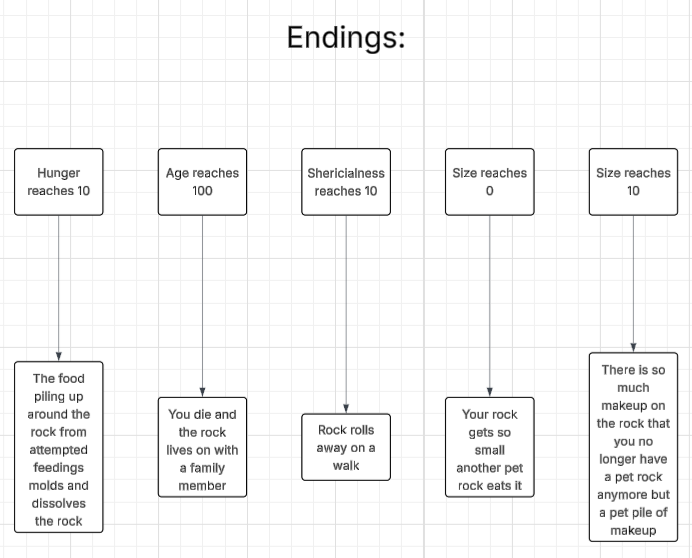

# Dylan Soule's Pet Rock Simulator

This Pet Rock Simulation brings you on an epic journey through pure human experiences and a story one will never forget

During the journey you get to interact with your pet rock, that you get to name, and get to decide what to do  
These decisions will affect key stats and ultimately lead to endings that will change the way you view life

## Requirements
* Python 3
* Does not require any external libraries however the built in time library is used

## Installation
* Download the [pet_rock.py](./pet_rock.py) file  
* Import the file into a code running software such as vscode or you can run in the terminal  
* Run the file

## How to Play
Begin by running the file, run the command below in your terminal if you are doing it there
```bash
cd [file path to decision_tree.py] | python3 decision_tree.py
```
After running the file you will begin by naming your rock, name it whatever you would like and then press enter

The game will then go over how it works and explain the stats that you control, including
* Happiness
* Hunger
* Age
* Sphericalness
* Size

You will then begin playing the game, which follows a daily cycle where every day you have the option to do one of 5 options, each of which will change your stats in some way.  
In order to select an option type the number option you wish to select(1-5) and then press enter

After playing enough you will reach 1 of 5 ending, but you'll have to play the game to find out what those are

Additionally you can end the game at the end of each day cycle if you wish to however this will not give one of the endings

### Possible Actions
* Feed Your Pet Rock
* Put Makeup Onto Your Pet Rock
* Lick Your Pet Rock
* Kick Your Pet Rock
* Do Nothing

### End Conditions
The game will end and an ending message will play if any of the following conditions are met
* Hunger Reaches 10
* Age Reaches 100
* Sphericalness Reaches 10
* Size Reaches 0
* Size Reaches 10

If hunger reaches 0 a message will also play at the beginning of the next day, however, the game will not end

## Program Flow
* The Program Runs based on specific outcomes defined in the flow chart [here](https://lucid.app/lucidchart/8943c60f-2936-4edf-9340-a66bb51323b8/edit?viewport_loc=446%2C-657%2C5216%2C2629%2C0_0&invitationId=inv_22faf6c7-6790-400d-b459-823c11742c94), or shown below:


